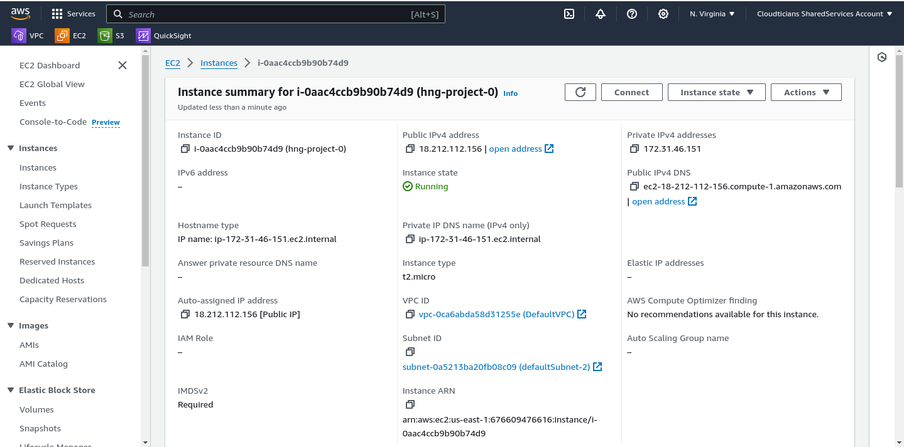
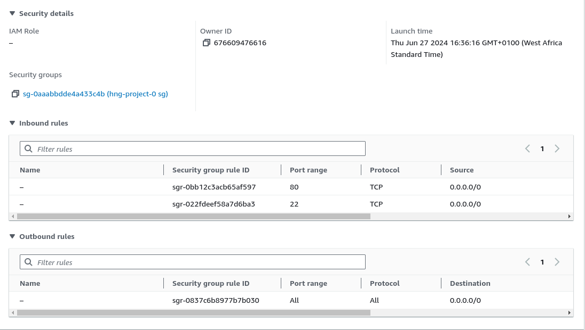
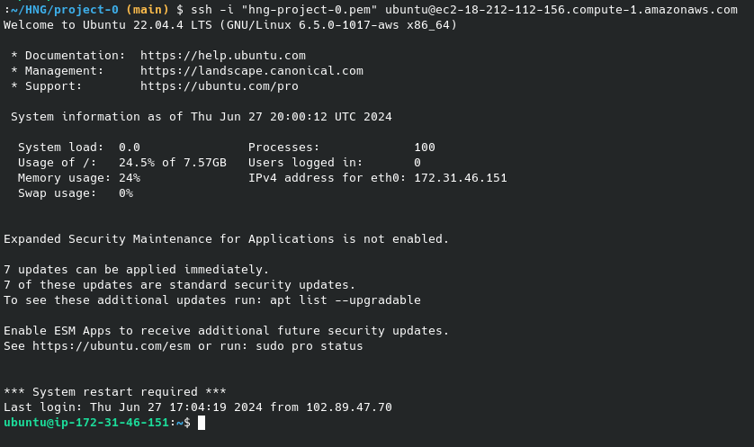
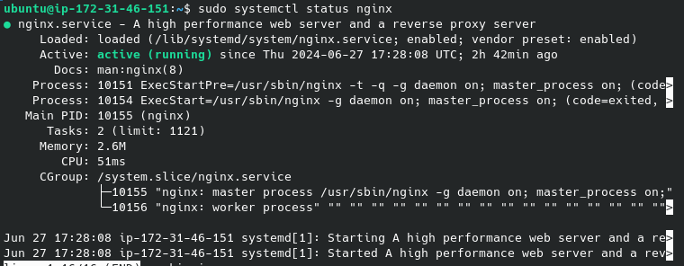

# Deploying a Static Website on AWS using Nginx

This guide will walk you through the steps I followed to deploy a static website on an AWS EC2 instance using the Nginx web server.

## Resource

- An AWS account
- A static website ready for deployment
- SSH client (Terminal Linux)

## Steps

### 1. EC2 Instance Created

   - 

This is the detailed of the ec2 instance I used.

   - 

   I configured the security group with the following rules:

   - SSH: Port 22, Source: My IP
   - HTTP: Port 80, Source: Anywhere

### 2. Connection to the EC2 Instance

1. **Using the Terminal/SSH Client**:
   - I change the permissions of the downloaded ec2 instance key pair file: `chmod 400 hng-project-0.pem`
   - Connect to the instance using: `ssh -i "hng-project-0.pem" ubuntu@18.212.112.156`

   


### 3. Install Nginx

1. **Update Packages**:
   ```bash
   sudo apt update && sudo apt upgrade -y

2. **Install Nginx**:
   ```bash
   sudo apt-get install nginx
   sudo systemctl status nginx

